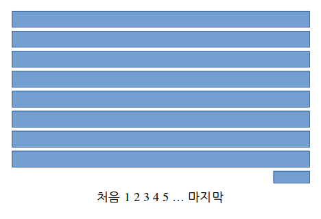

# 2. RestFramework를 활용하여 간단한 게시판 만들기(1)

**출처** : [PyCharm과 함께 DJango와 RestFramework를 활용하여 간단한 게시판 만들기(1)](https://devissue.wordpress.com/2015/02/15/pycharm%EA%B3%BC-%ED%95%A8%EA%BB%98-django%EC%99%80-restframework%EB%A5%BC-%ED%99%9C%EC%9A%A9%ED%95%98%EC%97%AC-%EA%B0%84%EB%8B%A8%ED%95%9C-%EA%B2%8C%EC%8B%9C%ED%8C%90-%EB%A7%8C%EB%93%A4%EA%B8%B01/)

---

### 게시판 서비스 구상하기

###### 어떤 게시판 서비스를 제공할 것인가?

- 한국형 게시판
  - 게시물 조회
  - 글쓰기
  - 수정은 보류
  - 삭제 가능
  - 댓글 보류


###### 게시판 모델링



1. 데이터는 **게시물 하나에 포함**되는 내용
   - 순번, 제목, 내용, 작성자, 작성 시간 등의 게시물 하나와 연관된 데이터
2. 게시판의 기능은 **게시물 하나를 제어**하기 위한 내용
   - 게시물 작성, 게시물 삭제


###### 게시물 데이터 모델링

1. 게시물의 고유한 인덱스
2. 게시물의 제목
3. 게시물의 내용
4. 게시물의 작성자
5. 게시물의 작성시간
6. 게시물의 고유 비밀번호

---

### 프로젝트 시작

###### 프로젝트 생성

```bash
django-admin.py startproject board .
```


###### APP 생성

```bash
django-admin.exe startapp post_service
```

