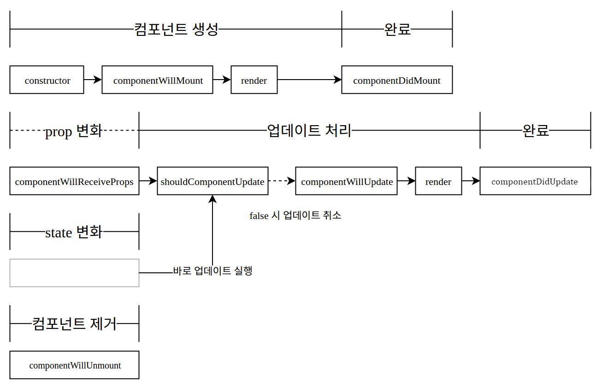
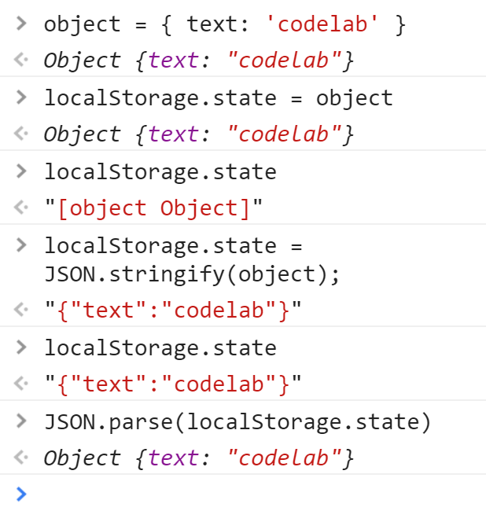

# Section4. 주소록(Contact) 만들기

### 1. Contact 검색기능 구현 | input, sort, filter

##### 0) 준비하기

- src/components/ContactInfo.js

```jsx
import React from 'react';

export default class ContactInfo extends React.Component {
    render() {
        return (
            <div>{this.props.contact.name} {this.props.contact.phone}</div>
        );
    }
}
```


- src/components/Contact.js

```jsx
import React from 'react';
import ContactInfo from './ContactInfo';

export default class Contact extends React.Component {
    
    constructor(props) {
        super(props);
        this.state = {
            contactData: [{
                name: 'Abet',
                phone: '010-0000-0001'
            }, {
                name: 'Betty',
                phone: '010-0000-0002'
            }, {
                name: 'Charlie',
                phone: '010-0000-0003'
            }, {
                name: 'David',
                phone: '010-0000-0004'
            }]
        };
        
    }
    
    render() {
        const mapToComponents = (data) => {
            return data.map((contact, i) => {
                return (<ContactInfo contact={contact} key={i}/>);
            });
        };
        
        return (
            <div>
                <h1>Contacts</h1>
                <div>{mapToComponents(this.state.contactData)}</div>
            </div>
        );
    }
}
```


- src/components/App.js

```jsx
import React from 'react';
import Contact from './Contact';

class App extends React.Component {
    render(){
        return (
                <Contact/>
        );
    }
}

export default App;
```


##### 1) 검색 기능

- src/components/Contact.js

  - input 렌더링

    ```
    <h1>Contacts</h1>
    <input name="keyword" placeholder="Search"
                    value={this.state.keyword} onChange={this.handleChange}/>
    ```

  - state에 keyword 추가

    ```jsx
    constructor(props) {
            super(props);
            this.state = {
                keyword: '',
                contactData: [{
                    name: 'Abet',
                    phone: '010-0000-0001'
                }, {
                    name: 'Betty',
                    phone: '010-0000-0002'
                }, {
                    name: 'Charlie',
                    phone: '010-0000-0003'
                }, {
                    name: 'David',
                    phone: '010-0000-0004'
                }]
            };

        }
    ```

    - 주의 : react-hot 사용시, 컴포넌트 클래스 constructor() 부분을 수정했다면, Hot Replacement 대신 브라우저 Refresh를 해야 한다.

  - handleChange 메소드 작성

    ```jsx
       constructor(props) {
            super(props);

            this.state = {
                keyword: "",
               /* 코드생략 */
            };

            this.handleChange = this.handleChange.bind(this); // 메소드 바인딩
        }

        handleChange(e) {
            this.setState({
                keyword: e.target.value
            });
        }
    ```


- JavaScript Array Functions

  - [sort](https://developer.mozilla.org/en-US/docs/Web/JavaScript/Reference/Global_Objects/Array/sort)

    - `arr.sort([compareFunction])`
    - `[compareFunction]`가 생략이 된다면 배열이 유니코드를 비교하여 오름차순으로 정렬
    - 기존 배열을 바꿔 버린다.

  - [filter](https://developer.mozilla.org/ko/docs/Web/JavaScript/Reference/Global_Objects/Array/filter)

    - `var new_array = arr.filter(callback[, thisArg])`
    - 함수를 전해줘서 함수가 만족하는 값만 새로운 배열 생성

  - **Contact.js** - render()

    ```jsx
           const mapToComponents = (data) => {
                data.sort();
                data = data.filter(
                    (contact) => {
                        return contact.name.toLowerCase()
                            .indexOf(this.state.keyword.toLowerCase()) > -1;
                    }
                );
                return data.map((contact, i) => {
                    return (<ContactInfo contact={contact} key={i}/>);
                });
            };
    ```

---

###  2. Contact 선택기능 구현 | React.js 기초개념 응용

##### 1) 선택 기능

- **ContactInfo.js**

  - name 만 보여주자

    ```jsx
        render() {
            return (
                <div>{this.props.contact.name}</div>
            );
        }
    ```


- **Contact.js**

  - handleClick 메소드

    ```jsx
        constructor(props) {
            ....
            this.state = {
                selectedKey: -1,
                ....
            }
           this.handleChange =this.handleChange.bind(this);
           this.handleClick = this.handleClick.bind(this);
        }

        handleChange(e) { ... }

        handleClick(key) {
            this.setState({
                selectedKey: key
            });

            console.log(key, 'is selected');
        }
    ```

  - 컴포넌트 매핑 부분 수정

    ```jsx
                return data.map((contact, i) => {
                    return (<ContactInfo
                                contact={contact}
                                key={i}
                                onClick={ () => { this.handleClick(i) } }
                            />);
                });
    ```

- **ContactInfo.js**

  - 전달받은 onClick 사용하게 하기

    ```jsx
        render() {
            return (
                <div onClick={this.props.onClick}>{this.props.contact.name}</div>
            );
        }
    ```


##### 2) ContactDetails 컴포넌트 파일 생성

- **src/components/ContactDetails.js**

  ```jsx
  import React from 'react';

  export default class ContactDetails extends React.Component {
      render() {

          // 선택되었을 때 보여질 부분
          const details = (
              <div>
                  <p>{ this.props.contact.name }</p>
                  <p>{ this.props.contact.phone }</p>
              </div>
          );

          // 아무것도 선택되지 않았을 때 보여질 부분
          const blank = (
              <div> Nothing is Selected </div>
          );

          return(
              <div>
                  <h2>Details</h2>

                  { /* isSelected props 값에 따라 어떤걸 보여줄지 정한다
                      ternary expression condition ? true : false */ }

                  { this.props.isSelected ? details : blank }

               </div>
          );
      }
  }

  ContactDetails.defaultProps = {
      contact: {
          name: "",
          phone: ""
      }
  }
  ```

- **Contact.js**

  - ComponentDetails 컴포넌트 import / render

    ```jsx
    import React from 'react';
    import ContactInfo from './ContactInfo';
    import ContactDetails from './ContactDetails';

    /* .. */
        render() {
            /*...*/
            return (
                <div>
                    <h1>Contacts</h1>
                    <input name="keyword" placeholder="Search"
                                value={this.state.keyword} onChange={this.handleChange}/>
                    <div>{mapToComponents(this.state.contactData)}</div>
                    <ContactDetails
                        contact={this.state.contactData[this.state.selectedKey]}
                        isSelected={this.state.selectedKey!=-1}/>
                </div>
            );

    /*...*/
    ```

---

### 3. state 내부 배열 처리하기 | Immutability Helper / ES6 spread

##### 1) State 내부 배열 처리

- state는 그 안의 데이터를 직접 수정하면 안된다
- 무조건 setState로 설정
- JavaScript array push : 배열 자체를 변경
- 그 대신 concat 사용 : 기존 배열을 두고 새 배열을 생성

```jsx
this.setState({
    list: this.state.list.concat(newObj)
})
```


##### 2) [Immutability Helper](https://facebook.github.io/react/docs/update.html)

- [immutable.js](https://facebook.github.io/immutable-js/docs/#/)

  ```bash
  npm install --save react-addons-update
  ```

  ```jsx
  /* Contact.js */
  import update from 'react-addons-update';
  ```


- 원소 추가
  ```jsx
  this.setState({
      list: update( /* update는 함수 */
                this.state.list, /* 처리해야할 객체나 배열 */
                {
                    $push: [newObj, newObj2] 
                    /* push 명령을 통해 newObj를 추가 */
                    /* 한 객체를 추가할 때도 배열을 사용 */
                } /* 처리 명령을 지니는 객체 */
  });
  ```


- 원소 제거
  ```jsx
  this.setState({
      list: update(
                this.state.list, 
                {
                    $splice: [[index, 1]]
                    /* list 배열의 index item부터 시작해서 1개의 item을 제거 */
                }
  });
  ```


- 원소 수정
  ```jsx
  this.setState({
      list: update(
                this.state.list, 
                {
                    [index]: { /* list 배열의 index번째 item의 field와 field 변경 */
                        field: { $set: "value" },
                        field2: { $set: "value2" }
                    }
                }
  });
  ```


##### 2-1) ES6 spread operator (전개연산자)

- <https://developer.mozilla.org/ko/docs/Web/JavaScript/Reference/Operators/Spread_operator>

---

### 4. Contact 추가/삭제/수정 기능 구현 | Immutability Helper 적용하기

##### 1) 데이터 추가/삭제/수정 메소드 만들기

- **src/components/Contact.js**

  ```jsx
  import React from 'react';
  import ContactInfo from './ContactInfo';
  import ContactDetails from './ContactDetails';
  import update from 'react-addons-update';

  export default class Contact extends React.Component {

      constructor(props) {
          /* ... */
          this.handleChange = this.handleChange.bind(this);
          this.handleClick = this.handleClick.bind(this);

          this.handleCreate = this.handleCreate.bind(this);
          this.handleRemove = this.handleRemove.bind(this);
          this.handleEdit = this.handleEdit.bind(this);
      }

      /* ... */

      handleCreate(contact) {
          this.setState({
              contactData: update(
                  this.state.contactData,
                  { $push: [contact] }
              )
          });
      }
    
      handleRemove() {
          this.setState({
              contactData: update(
                  this.state.contactData,
                  { $splice: [[this.state.selectedKey, 1]] }
              ),
                selectedKey: -1
          });
      }

      handleEdit(name, phone) {
          this.setState({
              contactData: update(
                  this.state.contactData,
                  {
                      [this.state.selectedKey]: {
                          name: { $set: name },
                          phone: { $set: phone }
                      }
                  }
              )
          });
      }
    
      /* ... */  
  ```

---

### 5. Contact 데이터 추가기능 구현 | 컴포넌트 응용

##### 1) 컴포넌트 생성

- **src/components/ContactCreate.js**

  ```jsx
  import React from 'react';

  export default class ContactCreate extends React.Component {
      constructor(props) {
          super(props);
      }

      render() {
          return (
              <div>
                  <h2>Create Contact</h2>
                  <p>
                      <input type="text" name="name" placeholder="name"/>
                      <input type="text" name="phone" placeholder="phone"/>
                  </p>
                  <button>Create</button>
              </div>
          )
      }
  }
  ```

  ​

##### 2) input 박스 state 값 설정

- **ContactCreate.js**

  ```jsx
  import React from 'react';

  export default class ContactCreate extends React.Component {
      constructor(props) {
          super(props);
          this.state = {
              name: '',
              phone: ''
          }
          this.handleChange = this.handleChange.bind(this);
      }

      handleChange(e) {
          let nextState = {};
          nextState[e.target.name] = e.target.value;
          this.setState(nextState);
      }

      render() {
          return (
              <div>
                  <h2>Create Contact</h2>
                  <p>
                      <input type="text" name="name" placeholder="name"
                          value={this.state.name} onChange={this.handleChange}/>
                      <input type="text" name="phone" placeholder="phone"
                          value={this.state.phone} onChange={this.handleChange}/>
                  </p>
                  <button>Create</button>
              </div>
          )
      }
  }
  ```


##### 3) 버튼 클릭 

- **ContactCreate.js**

  ```jsx
  /*...*/
      constructor(props) {
         /*...*/
          this.handleClick = this.handleClick.bind(this);
      }

      handleChange(e) { /*...*/ }

      handleClick() {
          const contact = {
              name: this.state.name,
              phone: this.state.phone
          };

          this.props.onCreate(contact);

          this.setState({
              name: '',
              phone: ''
          });
      }

      render() {
          return (
              <div>
                  <h2>Create Contact</h2>
                  <p>
                      <input type="text" name="name" placeholder="name"
                          value={this.state.name} onChange={this.handleChange}/>
                      <input type="text" name="phone" placeholder="phone"
                          value={this.state.phone} onChange={this.handleChange}/>
                  </p>
                  <button onClick={this.handleClick}>Create</button>
              </div>
          )
      }
  }
  ```

  ``` jsx
  /* 안해줘도 되는데 습관 들이자 */
  /* https://reactjs.org/docs/typechecking-with-proptypes.html */
  import React from 'react';
  import PropTypes from 'prop-types';

  /* ... */

  ContactCreate.propTypes = {
    onCreate: PropTypes.func
  }

  ContactCreate.defaultProps = {
    onCreate: () => { console.error('onCreate not defined') }
  }
  ```

  - Contact 컴포넌트에서 onCreate props를 받아온다


##### 4) ContactCreate 컴포넌트 import / render 

- **Contact.js**

  ```jsx
  import React from 'react';
  import ContactInfo from './ContactInfo';
  import ContactDetails from './ContactDetails';
  import ContactCreate from './ContactCreate';
  import update from 'react-addons-update';

  /*...*/

     render() {
         /* ... */
          return (
              <div>
                  <h1>Contacts</h1>
                  <input name="keyword" placeholder="Search"
                              value={this.state.keyword} onChange={this.handleChange}/>
                  <div>{mapToComponents(this.state.contactData)}</div>
                  <ContactDetails
                      contact={this.state.contactData[this.state.selectedKey]}
                      isSelected={this.state.selectedKey!=-1}/>
                  <ContactCreate onCreate={this.handleCreate}/>
              </div>
          );
      }
  }
  ```


---

### 6. Contact 데이터 삭제/수정 기능 구현 | 컴포넌트 응용

##### 1) 데이터 제거 기능

- **ContactDetails.js**

  - 버튼 생성 및 onClick 설정

    ```jsx
    import React from 'react';

    export default class ContactDetails extends React.Component {

        render() {

            const details = (
                <div>
                	<h2>Details</h2>
                    <p>{ this.props.contact.name }</p>
                    <p>{ this.props.contact.phone }</p>
                    <p>
                        <button onClick={this.props.onRemove}>Remove</button>
                    </p>
                </div>
            );

    /*...*/

    ContactDetails.defaultProps = {
        contact: {
            name: "",
            phone: ""
        },
        onRemove: () => { console.error('onRemove not defined') }
    }
    ```

    ​

- **Contact**

  - ContactDetails 렌더링 부분 수정

    ```jsx
    <ContactDetails
      contact={this.state.contactData[this.state.selectedKey]}
      isSelected={this.state.selectedKey!=-1}
      onRemove={this.handleRemove}/>
    ```

  - handleRemove 버그 고치기

    ```jsx
    handleRemove() {
      if(this.state.selectedKey < 0) {
        return;
      }
      
      this.setState({
        contactData: update(
          this.state.contactData,
          { $splice: [[this.state.selectedKey, 1]] }
        ),
        selectedKey: -1 // 현재 선택중인걸 무효화
      });
    }
    ```


##### 2) 데이터 수정 기능

- **ContactDetails.js**

  - Edit 버튼 렌더링

    ```jsx
    const details = (
      <div>
        <p>{ this.props.contact.name }</p>
        <p>{ this.props.contact.phone }</p>
        <p>
          <button>Edit</button>
          <button onClick={this.props.onRemove}>Remove</button>
        </p>
      </div>
    );
    ```

  - state.isEdit 추가, handleToggle 메소드 작성

    ```jsx
    constructor(props){
      super(props);

      this.state = {
        isEdit: false
      };

      this.handleToggle = this.handleToggle.bind(this);
    }

    handleToggle() {
      this.setState({
        isEdit: !this.state.isEdit
      });
    }
    ```

  - 버튼 누르면 handleToggle 호출, isEdit 값에 따라 텍스트  변경

    ```jsx
    <button onClick={this.handleToggle}>{this.state.isEdit ? 'Ok' : 'Edit'}</button>
    ```

  - 기존의 정보 나타내는 부분을 read 로 분리, edit 라는 상수를 임시로 설정
    isEdit 값에 따라 read 보여줄지 edit 보여줄지 결정

    ```jsx
    render() {
      const read = (
        <div>
          <p>{ this.props.contact.name }</p>
          <p>{ this.props.contact.phone }</p>
        </div>
      );

      const edit = (
        <div>
          EDIT
        </div>
      );

      const details = (
        <div>
          { this.state.isEdit ? edit : read }
          /* ... */
    ```

  - state.name state.phone 추가, handleChange 추가

    ```jsx
    constructor(props){
      super(props);

      this.state = {
        isEdit: false,
        name: '',
        phone: ''
      };

      this.handleToggle = this.handleToggle.bind(this);
      this.handleChange = this.handleChange.bind(this);
    }

    handleChange(e) {
      let nextState = {};
      nextState[e.target.name] = e.target.value;
      this.setState(nextState);
    }
    ```

  - edit 상수 수정

    ```jsx
    const edit = (
      <div>
        <p>
          <input
            type="text"
            name="name"
            placeholder="name"
            value={this.state.name}
            onChange={this.handleChange}
            />
        </p>
        <p>
          <input
            type="text"
            name="phone"
            placeholder="phone"
            value={this.state.phone}
            onChange={this.handleChange}
            />
        </p>
      </div>
    );
    ```

  - Edit 모드로 전환 될 때 state 를 props 값으로 설정

    ```jsx
    handleToggle() {
      if(!this.state.isEdit) {
        this.setState({
          name: this.props.contact.name,
          phone: this.props.contact.phone
        });
      }
      this.setState({
        isEdit: !this.state.isEdit
      });
    }
    ```

  - Read 모드로 전환 될 때 props.onEdit 사용

    ```jsx
    handleToggle() {
      if(!this.state.isEdit) {
        this.setState({
          name: this.props.contact.name,
          phone: this.props.contact.phone
        });
      } else {
        this.props.onEdit(this.state.name, this.state.phone);
      }
      this.setState({
        isEdit: !this.state.isEdit
      });
    }
    ```

- **Contact.js**

  - ContactDetails 컴포넌트에 handleEdit 전달

    ```jsx
    return (
      <div>
        <h1>Contacts</h1>
        <input
          name="keyword"
          placeholder="Search"
          value={this.state.keyword}
          onChange={this.handleChange}/>
        <div>{mapToComponents(this.state.contactData)}</div>
        <ContactDetails
          contact={this.state.contactData[this.state.selectedKey]}
          isSelected={this.state.selectedKey!=-1}
          onRemove={this.handleRemove}
          onEdit={this.handleEdit}
          />
        <ContactCreate onCreate={this.handleCreate}/>
      </div>
    );
    ```

---

### 7. Contact 엑스트라 기능 구현 i | KeyPress, ref

- https://gist.github.com/velopert/b77ac091003714df7e8e38304cd4d05a


##### 1) keypress 구현

- **ContactCreate.js**

  ```jsx
      constructor(props) {
          /* .. */
          this.handleKeyPress = this.handleKeyPress.bind(this);

      }

      handleKeyPress(e) {
          if(e.charCode==13) {
              this.handleClick();
          }
      }

      render() {
          return (
              <div>
                  <h2>Create Contact</h2>
                  <p>
                      <input type="text" name="name" placeholder="name"
                          value={this.state.name} onChange={this.handleChange}/>
                      <input type="text" name="phone" placeholder="phone"
                          value={this.state.phone} onChange={this.handleChange}
                          onKeyPress={this.handleKeyPress}/>
                  </p>
                  <button onClick={this.handleClick}>Create</button>
              </div>
          );
      }
  ```

  ​

- **ContactDetail.js**

  ```jsx
     constructor(props) {
          /* .. */
          this.handleKeyPress = this.handleKeyPress.bind(this);

      }

      handleKeyPress(e) {
          if(e.charCode==13) {
              this.handleToggle();
          }
      }

          const edit = (
              <div>
                  <p><input type="text" name="name" placeholder="name"
                          value={this.state.name} onChange={this.handleChange}
                          onKeyPress={this.handleKeyPress}/></p>
                  <p><input type="text" name="phone" placeholder="phone"
                          value={this.state.phone} onChange={this.handleChange}
                          onKeyPress={this.handleKeyPress}/></p>
              </div>
          );
  ```

  ​


##### 2) focus

- DOM에 직접 접근하는 방법 X
  - `document.getElementById(id).focus();` 방식을 사용하면 안된다

- **ref** 

  - react js의 ID와 비슷한 개념

  - 무조건 `document.getElementById(id).focus();` 을 사용하지 말라는 것은 아님

  - ref를 사용하여 해결 가능한 경우엔 ref 사용

  - outdated usage

    ```jsx
    class Hello extends React.Component {
        render() {
            return (
              <div> 
                <input ref="myInput">
                </input>
              </div>
            )
        }
      
        componentDidMount() {
          this.refs.myInput.value = "Hi, I used ref to do this";
        }
    }
     
    ReactDOM.render(
      <Hello/>,
      document.getElementById('app')
    );
    ```

  - **CURRENT** : use callback function

    ```jsx
    class Hello extends React.Component {
      render() {
       return (
           <div> 
               <input ref={(ref) => { this.input = ref} }>
                </input>
              </div>
            )
      }
      
      componentDidMount() {
       this.input.value = "I used ref to do this";
      }
      
    }
    ReactDOM.render(
      <Hello/>,
      document.getElementById('app')
    );
    ```

    ​

  ​

- **ContactCreate.js**

  ```jsx
     handleClick() {
          let contact = {
              name: this.state.name,
              phone: this.state.phone
          };

          this.props.onCreate(contact);

          this.setState({
              name: '',
              phone: ''
          });

          this.nameInput.focus();
      }

      render() {
          return (
              <div>
                  <h2>Create Contact</h2>
                  <p>
                      <input type="text" name="name" placeholder="name"
                          value={this.state.name} onChange={this.handleChange}
                          ref={ (ref) => { this.nameInput = ref } }/>
                      <input type="text" name="phone" placeholder="phone"
                          value={this.state.phone} onChange={this.handleChange}
                          onKeyPress={this.handleKeyPress}/>
                  </p>
                  <button onClick={this.handleClick}>Create</button>
              </div>
          )
      }
  ```

---

### 8. Component LifeCycle API

##### 1) Component LifeCycle API 

- componentWillMount : 렌더링 되기전 실행
- componentDidMount : 렌더링이 된 다음 실행
- componentWillReceiveProps : 새로운 props를 받았을 때 실행
- shouldComponentUpdate : 컴포넌트가 업데이트를 해야할지 말아야할지 정하는
- componentWillUpdate : 컴포넌트가 업데이트 되기 전 실행
- componentDidUpdate : 컴포넌트가 업데이트 된 후에 실행
- componentWillUnmount : 컴포넌트가 제거 될 때 실행




```jsx
class App extends React.Component {
    
    constructor(props){
        super(props);
        this.state = {
            number: 0,
            show: false
        }
    }
    
    _increase(){
        this.setState({
            number: this.state.number+1
        });
    }
    
    _show() {
        this.setState({
            show: true
        });
    }
    
    _unmount() {
        this.setState({
            number: 0,
            show: false
        });
    }
    
    render(){
        let component = (<Card number={this.state.number}/>);
        return  (
            <div>
                <Button caption="Show Card" customClass="green" onClick={this._show.bind(this)} />
                <Button caption="Increase Number" customClass="blue" onClick={this._increase.bind(this)}/>
                <Button caption="Unmount Card" customClass="red" onClick={this._unmount.bind(this)}/>
                {this.state.show ? component : ""}
            </div>
        );
    }
}

class Button extends React.Component {
    render() {
        let className = "ui button " + this.props.customClass;
        
        return (
            <div onClick={this.props.onClick}className={className}>{this.props.caption}</div>
            
        )
    }
}

class Card extends React.Component {
    constructor(props){
        super(props);
        console.log("constructor");
    }
    componentWillMount(){
        console.log("componentWillMount");
    }
    
    componentDidMount(){
        console.log("componentDidMount");
    }
    
    componentWillReceiveProps(nextProps){
        console.log("componentWillReceiveProps: " + JSON.stringify(nextProps));
    }
    
    shouldComponentUpdate(nextProps, nextState){
        console.log("shouldComponentUpdate: " + JSON.stringify(nextProps) + " " + JSON.stringify(nextState));
        return true;
    }
    
    componentWillUpdate(nextProps, nextState){
        console.log("componentWillUpdate: " + JSON.stringify(nextProps) + " " + JSON.stringify(nextState));
    }
    
    componentDidUpdate(prevProps, prevState){
        console.log("componentDidUpdate: " + JSON.stringify(prevProps) + " " + JSON.stringify(prevState));
    }
    
    componentWillUnmount(){
        console.log("componentWillUnmount");
    }
    
    render() {
        console.log("render");
        return (<div className="ui card">
        <div className="content">
            number: {this.props.number}
        </div>
    </div>)
}
}

ReactDOM.render(<App/>, document.getElementById('root'));
```


##### 2) 컴포넌트의 주요 메소드

- **constructor**

  - 컴포넌트가 처음 만들어질 때 실행 된다
  - 기본 state 를 설정 할 수 있다

  ```jsx
  constructor(props){
      super(props);
      console.log("constructor");
  }
  ```

- **componentWillMount**

  - 컴포넌트가 DOM위에 만들어지기 전에 실행된다

  ```jsx
  componentWillMount(){
      console.log("componentWillMount");
  }
  ```

- **componentDidMount**

  - 첫 렌더링 마치고 실행된다
  - 이 안에서 다른 자바스크립트 프레임워크 연동 및 setTimeout, setInterval 및 AJAX 사용

  ```jsx
  componentDidMount(){
      console.log("componentDidMount");
  }
  ```

- **componentWillReceiveProps**

  - props를 받을 때 실행된다
  - props 에 따라 state 를 업데이트 할 때 사용하면 유용하다
  - 이 안에서 setState를 해도 괜찮다

  ```jsx
  componentWillReceiveProps(nextProps){
      console.log("componentWillReceiveProps: " + JSON.stringify(nextProps));
  }
  ```


- **shouldComponentUpdate**

  - props/state 가 변경되었을 때 리렌더링을 할지말지 정한다
  - 실제로 사용 할 때 는 필요한 비교를 하고 값을 반환해야 한다
  - 예: `return nextProps.id !== this.props.id`
  - JSON.stringify 를 사용하여 여러 field 를 편하게 비교

  ```jsx
  shouldComponentUpdate(nextProps, nextState){
      console.log("shouldComponentUpdate: " + JSON.stringify(nextProps) + " " + JSON.stringify(nextState));
      return true;
  }
  ```

- **componentWillUpdate**

  - 컴포넌트 업데이트 전 실행된다
  - 여기서 setState 절대 사용하지 말 것

  ```jsx
  componentWillUpdate(nextProps, nextState){
      console.log("componentWillUpdate: " + JSON.stringify(nextProps) + " " + JSON.stringify(nextState));
  }
  ```

- **componentDidUpdate**

  - 컴포넌트가 리렌더링을 마친 후 실행된다
  - 여기서도 setState 사용 하지 말 것

  ```jsx
  componentDidUpdate(prevProps, prevState){
      console.log("componentDidUpdate: " + JSON.stringify(prevProps) + " " + JSON.stringify(prevState));
  }
  ```

- **componentWillUnmount**

  - 컴포넌트가 DOM 에서 사라진 후 실행된다

  ```jsx
  componentWillUnmount(){
      console.log("componentWillUnmount");
  }
  ```

---

### 9. Contact 데이터 새로고침해도 유지하기 | localStorage

##### 1) [localStorage](http://www.w3schools.com/html/html5_webstorage.asp)

- HTML5에서 지원
- 2.5M ~ 5M까지 저장 가능
- 서버로 전송되지 X




##### 2) localStorage 적용

- **Contact.js**

  - contactData 를 localStorage 에 담고 사용하기

  ```jsx
     componentWillMount() {
          // 컴포넌트를 가장 처음 그리기 전, contactData 의 값이 존재한다면
          // setState 를 통하여 저장되있던 값을 불러온다
          let contactData = localStorage.contactData;

          if(contactData) {
              this.setState({
                  contactData: JSON.parse(contactData)
              });
          }
      }

      componentDidUpdate(prevProps, prevState) {
          // state 가 변경 될 때 마다, 만약에 state 가 새롭다면
          // localStorage 에 현 contactData 의 데이터를 저장한다
          if(JSON.stringify(prevState.contactData) != JSON.stringify(this.state.contactData)) {
               localStorage.contactData = JSON.stringify(this.state.contactData);
          }

      }
  ```

- localStorage 초기화 : `localStorage.clear()`