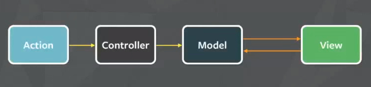
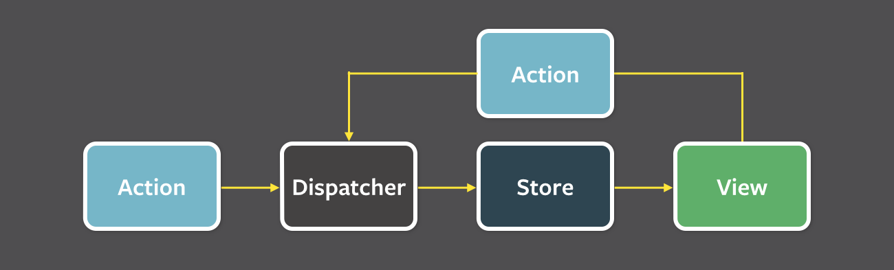
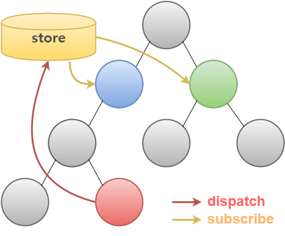
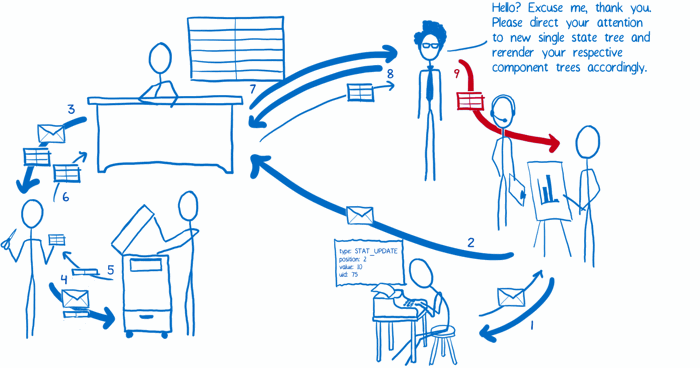

Section5. Redux

- http://slides.com/minjunkim-1/deck#/16

### 1. Redux; 배경지식 | MVC, FLUX

- [Understanding Redux (or, How I Fell in Love with a JavaScript State Container)](http://www.youhavetolearncomputers.com/blog/2015/9/15/a-conceptual-overview-of-redux-or-how-i-fell-in-love-with-a-javascript-state-container)
- 물건을 움직여서 재배치 > MVC
- 새 방을 만들어서 재배치 > Redux


##### 1) Redux

- 페이스북에서 리액트가 함께 소개한 FLUX Architect를 구현한 라이브러리
- 컴포넌트들끼리 데이터 교류 및 스테이트 관리를 쉽고 효율적으로 할 수 있게 해준다.


##### 2) MVC Design Pattern



- Action이 들어오면 Controller가 Model이 지니고 있는 데이터를 조회하거나 업데이트 할 수 있다. 이 변화는 View에 적용 됨
- View가 Model의 데이터를 업데이트 할 수 도 있다.


- 작은 App에서는 문제가 없다. 만약 큰 큐 모의 App라면?

  

  - Model의 의존성 문제
    - View가 Model을 업데이트 하거나 Model이 다른 Model을 업데이트 하거나
  - 비동기적으로 Model을 변경


##### 3) Flux



- 추상적인 개념
- Dispatcher가 받은 액션을 통제하여 Store에 있는 데이터를 업데이트
- 변동된 데이터가 있으면 View에 리렌더링
- View에서 Store에 직접 접근하지 않는다.
  - **Dispatcher로 Action을 보내 처리**
- Dispatcher에서는 작업이 **중첩되지 않게 해준다**.
  - 어떤 Action이 Dispatcher를 통하여 Store에 있는 데이터를 처리하고, 그 작업이 끝날 때까지 다른 Action을 대기


##### 4) [Flux 로의 카툰안내서](http://bestalign.github.io/2015/10/06/cartoon-guide-to-flux/)

###### 단방향 데이터 흐름(unidirectional data flow)

- 데이터가 단방향으로 흐름
- 새로운 데이터를 넣으면 처음부터 흐름이 다시 시작


###### 캐릭터

- 액션 생성자(the action creator)
  - 전보기사와 같다.
  - **App에서 어떤 부분이 업데이트 되어야 하는지 정의**를 해준다.
  - 업데이트 될 부분을 알려주면 Action을 생성해서 Dispatcher에 전송
- 디스패쳐(dispatcher)
  - 교환원과 같다.
  - Action을 받으면 어떤 부분을 업데이트 할지 정해준다
  - **동기적 실행**(우선권을 가진 Action부터 순차적 실행)
- 스토어(store)
  - 정부관료와 같다.
  - 모든 상태와 관련된 로직을 지니고 있다.
- 뷰(view)
  - 발표자
  - App 내부에 대해서는 아는 것이 없다.
  - 사람들이 이해할 수 있는 HTML로 바꾸는 방법을 알고 있다.


###### 준비작업(set up)

1. 스토어는 디스패쳐에 액션이 들어오면 알려달라고 말해둔다.
2. 컨트롤러 뷰는 스토어에게 최신 상태를 묻는다.
3. 스토어가 컨트롤러 뷰에게 상태를 주면 렌더링하기 위해 모든 자식 뷰에게 상태를 넘겨준다.
4. 컨트롤러 뷰는 스토어에게 상태가 바뀔 때 알려달라고 다시 부탁한다.


###### 데이터 흐름(the data flow)

1. 뷰는 액션 생성자에게 액션을 준비하라고 말한다.
2. 액션 생성자는 액션을 포맷에 맞게 만들어서 디스패쳐에 넘겨준다.
3. 디스패쳐는 들어온 액션의 순서에 따라 알맞은 스토어로 보낸다. 각 스토어는 모든 액션을 받게 되지만 필요한 액션만을 골라서 상태를 필요에 맞게 변경한다.
4. 상태 변경이 완료되면 스토어는 자신을 구독(subscribe)하고 있는 컨트롤러 뷰에게 그 사실을 알린다.
5. 연락을 받은 컨트롤러 뷰들은 스토어에게 변경된 상태를 요청한다.
6. 스토어가 새로운 상태를 넘겨주면, 컨트롤러 뷰는 자신 아래의 모든 뷰에게 새로운 상태에 맞게 렌더링하라고 알린다.

---

### 2. Redux: 특징과 흐름

- FLUX Architect를 사용하기 편하게 구현한 라이브러리
- FLUX의 구현체




- 각 노드들은 컴포넌트를 나타냄


##### 1) 3가지 원칙

###### Single Source of Truth : 단 하나의 진실의 근원

- 모든 진실은 하나의 근원에서 나온다.
- 어플리케이션의 state 를 위해 단 한개의 **store** 를 사용
  - Flux 와의 주요 차이
  - Flux 에서는 여러개의 store 를 사용
- store의 데이터 구조는 **개발자 하기 나름**
  - 보통 매우 nest한 구조
  - 컴포넌트 별로 구조화
  - 이벤트 별로 구조화
  - 앱의 데이터를 다루는 것과 컴포넌트 UI를 다루는 것과 따로 구조화


###### State is Read-only

- state를 변경하는 유일한 방법은 어떠한 일이 발생했는지 나타내주는**action 객체를 전달**해주는 것


- 어플리케이션에서 store 의 state 를 **직접** 변경할 수 없다.
- state 를 변경하기 위해선 무조건 **action** 이 **dispatch** 되어야 한다.


###### Changes are made with pure Functions

- **action** 객체를 처리하는 함수를 **reducer** 라고 부른다.
- **reducer** 는 정보를 받아서 상태를 어떻게 업데이트 할 지 정의
- **reducer **는 **'순수 함수' 로 작성**되어야 한다.
  - 비동기적인 처리 X
  - 네트워크 및 데이터베이스 접근 X, 인수 변경 X
  - 같은 인수로 실행된 함수는 언제나 같은 결과를 반환
  - **순수하지 않은** API 사용 불가 (Date.now(), Math.random() 등)


##### 2) [Redux 로의 카툰 안내서](http://bestalign.github.io/2015/10/26/cartoon-intro-to-redux/)

###### Flux의 문제점

1. 스토어의 코드는 어플리케이션 상태를 삭제하지 않고는 리로딩(reloading)이 불가능하다.

- Flux에서 스토어(store)는 다음의 두 가지를 포함
  - 상태변환을 위한 로직
  - 현재 어플리케이션 상태
- 핫 리로딩을 할 때 문제 발생
  - 새로운 상태 변환 로직을 위해 스토어 객체를 리로딩 하면 스토어에 저장되어있는 기존의 상태를 잃어버림
  - 스토어와 시스템의 나머지 부분 사이에 있는 이벤트 구독(event subscription)까지 망가짐
- 해결 방법 : 두 기능을 분리
  - 한 객체는 애플리케이션 상태만을 포함 : 이 객체는 리로딩하지 않도록
  - 또 다른 객체는 모든 상태 변환 로직을 포함 : 이 객체는 상태를 가지고 있지 않으므로 걱정없이 리로딩 할 수 있을 것

2. 어플리케이션 상태는 매 액션마다 재기록된다.

- 시간 여행 디버깅을 위해서는 상태 객체의 모든 버전들을 기록해야 한다.
- 매번 상태가 새로 바뀔 때마다 이전 App 상태를 상태 객체의 버전들을 저장하는 배열에 추가할 필요가 있음
  - JavaScript의 동작방식 때문에 단순히 상태를 가진 변수를 배열에다가 추가하는 것만으로는 부족
  - 이 방식으로는 App 상태의 스냅샷(snapshot)을 생성하는게 아니라 같은 객체를 가리키는 새로운 포인터(pointer)를 생성
- 각각의 버전이 완벽히 독립된 객체가 되야한다.
- 해결 방법
  - 액션이 스토어로 전달되었을때 기존의 애플리케이션 상태를 수정하는 대신, 그 상태를 복사한 뒤 복사본을 수정

3. 서드파티 플러그인(third-party plugin)이 들어갈 좋은 장소가 없다.

- 서드파티 플러그인을 추가할 수 있는 장소인 확장점(extension point)이 필요
  - 개발자 도구는 여러 곳에 쉽게 쓰일 수 있도록 만들어야함
  - 사용자는 자신의 코드를 수정하지 않고도 간단히 코드 몇 줄을 집어넣는 것만으로 개발자 도구를 사용할 수 있어야함
- 예시 : logging
  - 매 액션마다 `console.log()`를 실행한다고 가정
  - 액션이 들어왔을 때 그 액션의 결과로서 만들어지는 새로운 상태를 로깅
- Flux에서는 디스패쳐의 업데이트와 각 스토어의 업데이트를 구독(subscribe)
  - 서드파티 모듈(third-party module)이 쉽게 할 수 있는 것이 아님
- 해결방법
  - 시스템의 부분을 다른 객체들로 쉽게 감쌀 수 있게 만들어보자.
    - 이 객체들은 약간의 추가 기능들을 시스템의 부분에 추가
    - 이런 확장점(extension point)을 **enhancer** 또는 **higher order** 객체 혹은 **미들웨어(middleware)**라고 부른다.
  - 상태 변환 로직(state change logic)을 트리를 사용해서 구조화
    - 상태가 변했다는 것을 뷰에게 알리기 위해 스토어는 단 하나의 이벤트만 보내면 될 것
    - 이 이벤트는 모든 상태 트리가 처리 된 뒤에 보낸다.

5. [그 외 Redux의 장점 리스트](https://stackoverflow.com/questions/32461229/why-use-redux-over-facebook-flux/32920459#32920459)


###### 캐릭터

- 액션 생성자
  - Redux는 Flux에서 액션 생성자와 동일
  - 상태를 바꾸고 싶다면 항상 액션을 보내야 한다.
  - Redux의 액션 생성자는 디스패쳐(dispatcher)로 액션을 보내지는 않는다.
    - 대신, 포맷을 바꾼 뒤 액션을 돌려준다.
- 스토어
  - Flux에서는 다수의 스토어를 가진다.
  - Redux는 단 하나의 스토어를 가진다.
  - Redux의 스토어는 상태 트리(state tree) 전체를 유지하는 책임
  - 액션이 들어왔을 때 어떤 상태변화가 필요한지에 대한 일은 위임
  - 디스패쳐가 존재하지 X, 그 대신 어떤 작업을 해야할지 하는 것은 스토어가 넘겨 받음
- 리듀서(the reducers)
  - 서류 복사에 지나치게 열성적인 사무실 직원들과 같다.
    - 넘겨받은 예전 상태는 변경하지 않는다. 대신 새로운 복사본을 만든 후 거기에다가 모든 변경사항을 적용
  - 작업을 실질적으로 수행
  - **변화를 일으켜주는 함수**
  - 스토어는 액션이 어떤 상태 변화를 만드는지 알 필요가 있을 때 리듀서에게 묻는다.
  - 한 개 일 수 도 있고 여러 개 일 수도 있다.
    - 한 개일 경우, 루트 리듀서(root reducer)가 액션을 처리
    - 여러 개일 경우, 루트 리듀서는 전달받은 액션을 처리하는 리듀서를 찾아 그 리듀서에게 넘겨준다.
  - **상태 객체는 직접 변경되지 않는다**. 대신, 각각의 상태 조각이 **복사** 후 변경되고 **새로운 상태 객체 하나로 합쳐진다**.
  - Redux는 리듀서가 **트리** 모양의 계급구조 안에 존재
    - 컴포넌트 구조처럼 필요한 만큼의 레벨(트리의 높이)을 얼마든지 가질 수 있다.
- 뷰: 똑똑한 컴포넌트와 멍청한 컴포넌트(the views: smart and dumb components)
  - 똑똑한 컴포넌트는 액션 처리를 책임
    - 똑똑한 컴포넌트 밑의 멍청한 컴포넌트가 액션을 보낼 필요가 있을 때, 똑똑한 컴포넌트는 props를 통해서 멍청한 컴포넌트에 함수를 전송
    - 멍청한 컴포넌트는 받은 함수를 콜백으로써 단순히 호출
  - 똑똑한 컴포넌트는 자기 자신의 CSS style을 가지고 있지 않다.
  - 똑똑한 컴포넌트는 자기 자신의 DOM을 거의 가지고 있지 않다. 
    - 대신, DOM 요소들을 관리하는 멍청한 컴포넌트들을 관리
  - 멍청한 컴포넌트는 액션에 직접 의존성을 가지지 않는다.
    - 모든 액션을 props를 통해서 넘겨 받기 때문에
    - 다른 로직을 가진 다른 애플리케이션에서 재사용될 수 있다는 뜻
  - 멍청한 컴포넌트는 어느정도 보기좋게 할만큼의 CSS style도 포함
    - 따로 style props를 받아 기본 style에 병합시켜서 style을 바꿀수도 있다
- 뷰 레이어 바인딩(the view layer binding)
  - **스토어를 뷰에 연결**
  - 모든 컴포넌트를 스토어에 연결
  - 뷰 레이어 바인딩은 뷰 트리(view tree)를 위한 IT 부서
    - 많은 기술적인 세부사항들을 처리해서 트리 구조가 세부사항에 신경 쓰지 않도록 해준다.
  - 공급 컴포넌트(provider component)
    - 컴포넌트 트리를 감싸는 컴포넌트
    - `connect()`를 이용해 루트 컴포넌트 밑의 컴포넌트들이 스토어에 연결되기 쉽게 만들어준다.
  - `connect()`
    - react-redux가 제공하는 함수
    - 컴포넌트가 애플리케이션 상태 업데이트를 받고 싶으면 `connect()`를 이용해서 컴포넌트를 감싸주면 된다. 
    - `connect()`가 셀렉터(select)를 이용해서 필요한 모든 연결을 생성
  - 셀렉터(selector)
    - 직접 만들어야 하는 함수
    - App 상태 안의 어느 부분이 컴포넌트에 props로써 필요한 것인지 지정
- 루트 컴포넌트(the root component)
  - CEO
  - 모든 팀이 일을 하도록 하는 임무
  - 전반적으로 Redux의 기본적인 설정을 맡음
    - 스토어를 생성하고 무슨 리듀서를 사용할지 알려주며 뷰 레이어 바인딩과 뷰를 호출
  - App 초기화한 뒤로는 거의 하는 일이 없다.


###### 준비 작업

- 애플리케이션의 여러 부분이 모두 함께 연결


1. **스토어를 준비한다.** 

- 루트 컴포넌트는 `createStore()`를 이용해서 스토어를 생성하고 무슨 리듀서를 사용할지 알려준다. 
- 루트 컴포넌트는 이미 필요한 모든 리듀서를 가지고 있다.
- `combineReducers()`를 이용해서 다수의 리듀서를 하나로 묶는다.

2. **스토어와 컴포넌트 사이의 커뮤니케이션을 준비한다.** 

- 루트 컴포넌트는 공급 컴포넌트로 서브 컴포넌트를 감싸고 스토어와 공급 컴포넌트 사이를 연결
- 공급 컴포넌트는 기본적으로 컴포넌트를 업데이트하기 위한 네트워크를 생성
- 똑똑한 컴포넌트는 `connect()`로 네트워크에 연결

3. **액션 콜백(action callback)을 준비한다.** 

- 멍청한  컴포넌트가 액션과 쉽게 일할 수 있게 하기 위해 똑똑한 컴포넌트는 `bindActionCreators()`로 액션 콜백을 준비]
  - 간단하게 콜백을 멍청한 컴포넌트에 넘겨줄 수 있다.
- 액션은 포맷이 바뀐 뒤 자동적으로 전송


###### 데이터 흐름



1. 뷰가 **액션을 요청**한다. 액션 생성자가 포맷을 변환한 뒤 돌려준다.
2. `bindActionCreators()`가 준비과정에서 사용되었으면 자동으로 액션이 보내진다. 그게 아니라면 뷰가 직접 액션을 보낸다.
3. **스토어가 액션을 받는다**. 현재 애플리케이션 **상태 트리와 액션을 루트 리듀서에게** 보낸다.
4. **루트 리듀서는** 상태 트리를 조각으로 나눈 뒤 알맞은 **서브 리듀서로 상태 조각들을 넘겨준다**.
5. 서브 리듀서는 받은 **상태 조각을 복사**한 뒤, 그 **복사본을 변경**한다. 루트 리듀서에게 변경된 복사본을 돌려준다.
6. 모든 서브 리듀서가 변경 된 상태 조각들을 돌려주면, 루트 리듀서는 이 상태 조각들을 한데 모아 **상태 트리로 만든 뒤 스토어로** 돌려준다. 스토어는 **새로운 상태 트리를 옛날 상태 트리와 바꾼다**.
7. 스토어는 뷰 레이어 바인딩에게 **애플리케이션 상태가 변경되었다는 것을 알린다**.
8. 뷰 레이어 바인딩은 **스토어에게 새로운 상태를 보내달라고 요청**한다.
9. 뷰 레이어 바인딩은 **뷰에게 화면을 업데이트하도록 요청**한다.

---

### 3. Redux: 프로젝트 준비하기 | create-react-app

##### 1) create-react-app 

- https://reactjs.org/blog/2016/07/22/create-apps-with-no-configuration.html


###### create-react-app global 설치

```bash
npm install -g create-react-app
```


###### 프로젝트 생성

```bash
create-react-app redux-example
```


###### 서버실행

```bash
npm start
```


###### 빌드

```bash
npm run build
```


##### 2) 의존 모듈 설치

```bash
npm install --save redux react-redux
npm install --save-dev babel-preset-stage-0
npm install --save prop-types
```

- react-redux : 뷰 레이어 바인딩

---

### 4. Redux: 프로젝트 구조 및 컴포넌트 생성 

##### 0) 프로젝트 구조 설정

- src 안의 파일 제거
- src에 디렉토리 생성
  - actions
  - components
  - reducers


##### 1) Snippets

- 설정하는 법 : File - Snippet
- https://gist.github.com/velopert/8f22cf0830e65f6de8ae99808c5b92f5
- react 기본 Snippets : `rcc6`


###### src\components\App.js

```js
rc
```

- class 이름을 App으로 변경
- propTypes, defaultProps를 왜 미리 선언해서 사용하는가?
  - https://github.com/airbnb/javascript/tree/master/react


###### src\index.js

```js
import React from 'react';
import ReactDOM from 'react-dom';

import App from './components/App';

ReactDOM.render(
  <App />,
  document.getElementById('root')
);
```


##### 1) 무슨 프로젝트를 만드는가?

###### 숫자 카운터

- **숫자**, 그리고 **버튼** 3개
  - 버튼1 : 값 1씩 증가
  - 버튼2 : 값 1씩 감소
  - 버튼3 : 배경화면 색상 랜덤화


###### 개발 순서

1. Action 만들기
2. Reducer 만들기
3. Redux 초기 설정 하기
4. 컴포넌트에 연결하기


##### 2) 필요한 컴포넌트

- Value.js(Dumb Component) : 숫자를 보여주는 컴포넌트
- Control.js(Dumb Component) : 버튼 3개를 보여주는 컴포넌트
- Counter.js(Smart Component) : 위 두개의 컴포넌트를 담고 있을 부모 컴포넌트

> 
>
> https://dobbit.github.io/redux/docs_kr/basics/UsageWithReact.html
>
> 
>
> - Smart 컴포넌트는 Redux와 연결
> - Dumb 컴포넌트는 Smart 컴포넌트의 props를 받아와 사용
> - Smart 컴포넌트는 DOM과 CSS를 거의 가지고 있지 않다.
>   - Dumb 컴포넌트를 불러 사용
> - Dumb 컴포넌트들이 DOM을 관리하고, 자신들의 CSS이 있다.


###### src\components\Value.js

```js
import React, { Component } from 'react';
import PropTypes from 'prop-types';


const propTypes = {
  number: PropTypes.number
};

const defaultProps = {
  number: -1
};

class Value extends Component {
    constructor(props) {
        super(props);
    }
    render() {
        return(
            <div>
              <h1>{this.props.number}</h1>
            </div>
        );
    }
}

Value.propTypes = propTypes;
Value.defaultProps = defaultProps;

export default Value;
```


###### src\components\Control.js

```js
import React, { Component } from 'react';
import PropTypes from 'prop-types';

const propTypes = {
  onPlus: PropTypes.func,
  onSubtract: PropTypes.func,
  onRandomizeColor: PropTypes.func
};

function createWarning(funcName) {
  return () => console.warn(funcName + ' is not defined');
}

const defaultProps = {
  onPlus: createWarning('onPlus'),
  onSubtract: createWarning('onSubtract'),
  onRandomizeColor: createWarning('onRandomizeColor')
};

class Control extends Component {
    constructor(props) {
        super(props);
    }
    render() {
        return(
            <div>
              <button onClick={this.props.onPlus}> + </button>
              <button onClick={this.props.onSubtract}> - </button>
              <button onClick={this.props.onRandomizeColor}> Randomize Color </button>
            </div>
        );
    }
}

Control.propTypes = propTypes;
Control.defaultProps = defaultProps;

export default Control;
```


###### src\components\Counter.js

```js
import React, { Component } from 'react';
import PropTypes from 'prop-types';

import Value from './Value';
import Control from './Control'

const propTypes = {

};

const defaultProps = {

};

class Counter extends Component {
    constructor(props) {
        super(props);
    }
    render() {
        return(
            <div>
              <Value />
              <Counter />
            </div>
        );
    }
}

Counter.propTypes = propTypes;
Counter.defaultProps = defaultProps;

export default Counter;
```


###### src\components\App.js

```js
import React, { Component } from 'react';
import PropTypes from 'prop-types';

import Counter from './Counter';

const propTypes = {

};

const defaultProps = {

};

class App extends Component {
    constructor(props) {
        super(props);
    }
    render() {
        return(
            <Counter />
        );
    }
}

App.propTypes = propTypes;
App.defaultProps = defaultProps;

export default App;
```

---

### 5. Redux: Action

##### 1) Action

- **작업에 대한 정보**를 지니고 있는 **객체**
- 이름은 **대문자**와 **_**를 사용
- `{type: ". . ."}`


##### 2) 프로젝트에서 필요한 액션은?

- 값을 증가시키기 : INCREMENT
- 값을 감소시키기 : DECREMENT
- 새로운 색상 설정하기 : SET_COLOR


###### src\actions\ActionTypes.js

```js
export const INCREMENT = "INCREMENT";
export const DECREMENT = "DECREMENT";
export const SET_COLOR = "SET_COLOR";
```


###### src\actions\index.js

- 액션 생성자
- 이름이 index.js인 이유는 actions라는 파일이 로드될 때 자동으로 로드하기 위해서

```js
// import { INCREMENT, DECREMENT, SET_COLOR } from './ActionTypes';
import * as types from './ActionTypes';

export function increment() {
  return {
    type: types.INCREMENT
  };
}

export function decrement() {
  return {
    type: types.DECREMENT
  };
}

export function setColor(color) {
  return {
    type: types.SET_COLOR,
    color
  };
}
```

---

### 6. Redux: Reducer

##### 1) Reducer

- **변화**를 일으키는 함수
- **순수**해야함
  - 비동기 작업 X
  - 인수 변경 X
  - 동일한 인수 = 동일한 결과
  - `Date.now()`, `randomizing function`을 사용하면 안된다.
- **이전 상태**와 **액션**을 받아서 **다음 상태**를 반환
  - `(previousState, action) => newState`
- 이전 상태를 변경하는 것이 아님, 그저 **새로운 상태를 반환**하는 것!
  - 기존 상태를 **복사**하고 변화를 준 다음에 **반환**


##### 2) 프로젝트에서 필요한 리듀서는? 


###### src\reducers\counter.js

```js
import * as types from '../actions/ActionTypes';

// reducer의 초기 상태 정의
const initialState = {
  number: 0,
  dummy: 'dummy dummy',
  dumbObject: {
    d: 0,
    u: 1,
    m: 2,
    b: 4
  }
};

export default function counter(state = initialState, action){
  switch (action.type) {
    case types.INCREMENT:
      return {
        ...state,
        number: state.number + 1,
        dumbObject: {...state.dumbObject, u: 0}
      };

    case types.DECREMENT:
      return {
        ...state,
        number: state.number - 1
      };
    default:
      return state;
  }
}
```

- `export default fuction counter(state = initialState, action)`
  - state가 undefine일 경우 initialState를 사용한다.


###### src\reducers\ui.js

```js
import * as types from '../actions/ActionTypes';

const initialState = {
  color: [255, 255, 255]
};

export default function ui(state = initialState, action) {
  if(action.type === types.SET_COLOR) {
    return {
      color: action.color
    };
  } else {
    return state;
  }
}
```


###### src\reducers\index.js

- counter reducer와 ui reducer를 합쳐준다.

```js
import { combineReducers } from 'redux';

import counter from './counter'
import ui from './ui'

const reducers = combineReducers({
  counter, ui
});

export default reducers;
```

---

### 7. Redux: Store

##### 1) Store

- 어플리케이션의 **현재 상태**를 지니고있음
- `createStore`
  - reducer를 인수로 전달하여 함수 실행

###### Store가 하는 일

- dispatch(action)
  - action을 reducer로 보낸다.
  - reducer 함수에 현재 자신의 상태와 방금 전달받은 action을 전달해 준다.
- getState()
  - 현재 상태를 반환
- subscribe(listener)
  - 상태가 바뀔 때마다 실행할 함수를 등록
  - `listener` : 상태가 바뀔 때마다 실행될 callback 함수
- replaceReducer(nextReducer)
  - hot reloading과 코드 분할을 구현할 때 사용
  - 보통 사용될 일이 없다


###### src\index.js

```js
import React from 'react';
import ReactDOM from 'react-dom';

import App from './components/App';

import { createStore } from 'redux';
import reducers from './reducers';
import * as actions from './actions';

const store = createStore(reducers);

// console.log(store.getStore());

// store.subscribe(() => console.log(store.getState()));
// const unsubscribe = store.unsubscribe(() => console.log(store.getState()));

// store.dispatch(actions.increment());
// store.dispatch(actions.increment());
// store.dispatch(actions.decrement());
// store.dispatch(actions.setColor([200, 200, 200]));

// unsubscribe();
// store.dispatch(actions.setColor([210, 210, 210]));

ReactDOM.render(
  <App />,
  document.getElementById('root')
);
```

- `const store = createStore(reducers)`
  - store 생성
- `console.log(store.getStore())`
  - store의 현재 상태를 console에 출력
- `store.subscribe(() => console.log(store.getState()));`
  - state가 변화가 있을 때 함수가 실행
  - 그 함수의 내용은 현재 store의 내용을 콘솔에 출력
- `store.dispatch(actions.increment());`
  - action을 전송
- `unsbscribe`
  - 더 이상 알림을 받기 싫다

---

### 8. Redux: react-redux | 컴포넌트에서 사용하기

##### 1) react-redux

- 뷰 레이어 바인딩 도구
- React 컴포넌트에서 Redux를 사용할 때 복잡한 작업을 해준다.


###### Provider

- 컴포넌트에서 Redux를 사용할 수 있게 서비스 제공
- 하나의 컴포넌트

```js
<Provider store={store}>
	<App />
</Provider>
```


###### src\index.js : Provider 적용

```js
import React from 'react';
import ReactDOM from 'react-dom';

import App from './components/App';

import { createStore } from 'redux';
import reducers from './reducers';

import { Provider } from 'react-redux';

const store = createStore(reducers);

ReactDOM.render(
  <Provider store={store}>
    <App />
  </Provider>,
  document.getElementById('root')
);
```


###### connect([...options])

- 컴포넌트를 Redux에 연결하는 **또다른 함수**를 반환
- `connect()(Counter)`
  - store에 연결 된 **새로운** 컴포넌트 클래스가 반환
  - 옵션이 없으면 `this.props.store`로 접근 가능
- options : 좀 더 깔끔해지고 편하다.
  - `[mapStateToProps]`
    - state를 파라미터로 가지는 **함수**
    - state를 해당 컴포넌트의 props로 연결
  - `[mapDispatchToProps]`
    - dispatch를 파라미터로 가지는 **함수**
    - dispatch한 함수를 props로 연결
  - `[mergeProps]`
    - state와 dispatch를 파라미터로 가지는 **함수**
    - 컴포넌트에 연결해야할 props가 state와 dispatch인 경우
    - 잘 사용되지 않는다.
  - `[options]`
    - `{[pure = true], [withRef = false]}`를 가지는 **객체**
    - `pure`의 기본 값 : ture
      - 불필요한 업데이트 안함
    - `withRef`의 기본 값 : false
      - 만약, true로 설정되어 있으면 Redux에 연결된 컴포넌트를 ref에 담아서 `getWrappedInstance()`로 사용할 수 있게 함
      - 자주 사용할 일 없다.


###### src\components\Counter.js : Redux 연결

```js
import React, { Component } from 'react';
import PropTypes from 'prop-types';

import Value from './Value';
import Control from './Control'

import { connect } from 'react-redux';
// import { connect, bindActionCreaters } from 'react-redux';

import * as actions from '../actions';

const propTypes = {

};

const defaultProps = {

};

class Counter extends Component {
    constructor(props) {
        super(props);

        this.setRandomColor = this.setRandomColor.bind(this);
    }

    setRandomColor() {
      const color = [
        Math.floor(Math.random()*55) + 200,
        Math.floor(Math.random()*55) + 200,
        Math.floor(Math.random()*55) + 200
      ];

      this.props.handleSetColor(color);
    }

    render() {
        const color = this.props.color;
        const style = {
          background: `rgb(${color[0]}, ${color[1]}, ${color[2]})`
        };

        return(
            <div style={style}>
              <Value number={this.props.number}/>
              <Control
                onPlus={this.props.handleIncrement}
                onSubtract={this.props.handleDecrement}
                onRandomizeColor={this.setRandomColor}
              />
            </div>
        );
    }
}

Counter.propTypes = propTypes;
Counter.defaultProps = defaultProps;

const mapStateToProps = (state) => {
  // redux의 state를 지칭
  return {
    number: state.counter.number,
    color: state.ui.color
  };
};

const mapDispatchToProps = (dispatch) => {
  return {
    handleIncrement: () => { dispatch(actions.increment()) },
    handleDecrement: () => { dispatch(actions.decrement()) },
    handleSetColor: (color) => { dispatch(actions.setColor(color)) }
  };

  // return bindActionCreaters(actions, dispatch);
};

export default connect(mapStateToProps, mapDispatchToProps)(Counter);
```

- `bindActionCreaters(actions, dispatch)` : https://redux.js.org/docs/basics/UsageWithReact.html
- `connect(mapStateToProps, mapDispatchToProps)(Counter);`
  - `connect()`가 함수를 반환하고, 그 함수의 파라미터로 `Counter`컴포넌트를 넘겨준다.- 
- `rgb(${color[0]}, ${color[1]}, ${color[2]})`
  - [Template literals](https://developer.mozilla.org/ko/docs/Web/JavaScript/Reference/Template_literals)


- 불필요하게 선언된 constructor, propsTpyes, defaultProps 제거